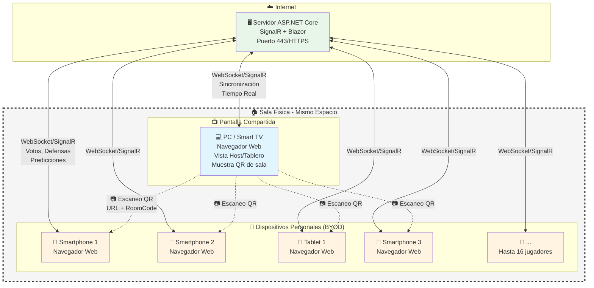

# Pandorium – Juego social web multi-dispositivo

**Pandorium** es un juego social de salón pensado para grupos de **4 a 16 jugadores** que comparten una misma sala física.

Cada partida se juega con:
- una **pantalla principal** (ordenador o Smart TV con navegador), y  
- los **móviles/tablets** de los jugadores, sin instalación de apps (solo navegador + QR).

El juego plantea **casos o situaciones sociales** en los que los jugadores:
- acusan en secreto a quien creen que encaja mejor en cada caso,
- realizan apuestas sobre qué decidirá la mayoría,
- y resuelven defensas y contraacusaciones.

El sistema asigna **títulos sociales** (insignias) a los jugadores según las decisiones del grupo.  
Un **comentarista automático** basado en IA generativa narra lo que ocurre (acusados, resultados, títulos) sin intervenir en las reglas ni en el resultado del juego.

---

## Características principales

- Party game web **zero-install** (solo navegador y código QR).
- Admite **4–16 jugadores** en la misma sala física.
- Mecánicas pensadas para:
  - generar risas y pequeñas fricciones amistosas,
  - crear "títulos sociales" y running gags para el grupo.
- Arquitectura **.NET 10** con:
  - ASP.NET Core, SignalR, Blazor, EF Core, Aspire.
- Motor de juego **determinista**, desacoplado de la IA.
- Módulo de comentariado con **IA generativa** como capa extra de ambientación.

---

## Topología de red y modelo BYOD

El proyecto está diseñado bajo el concepto **Bring Your Own Device (BYOD)**, aprovechando dispositivos que los jugadores ya poseen y tecnologías web estándar para eliminar barreras de entrada.



### Ventajas del modelo BYOD + Tecnologías estándar

| Aspecto | Beneficio |
|---------|-----------|
| **Sin instalación** | Los jugadores solo necesitan un navegador web moderno (Chrome, Safari, Edge, Firefox). No se requiere descarga de apps. |
| **Acceso vía QR** | La pantalla principal muestra un código QR que, al escanearse, abre directamente la sala en el navegador móvil. |
| **Multiplataforma** | Compatible con iOS, Android, Windows, macOS, Linux. Cualquier dispositivo con navegador. |
| **Cero hardware propietario** | No se necesitan mandos, consolas o periféricos específicos. |
| **Escalabilidad** | Soporta 4-16 jugadores simultáneos usando sus propios dispositivos. |
| **Tecnologías web estándar** | HTML5, CSS3, JavaScript/WebAssembly (Blazor), WebSockets (SignalR). |
| **Pantalla compartida flexible** | Puede ser un PC conectado a TV, una Smart TV con navegador, o proyección vía el protocolo de Google Cast. |

### Flujo de conexión

1. **Host** accede a la aplicación web y crea una sala
2. **Servidor** genera un código de sala único y lo muestra como QR en pantalla
3. **Jugadores** escanean el QR con la cámara de sus dispositivos
4. **Navegador móvil** abre automáticamente la URL con el código de sala
5. **Jugador** introduce su alias y se une a la partida
6. **SignalR** mantiene sincronizados en tiempo real todos los dispositivos

---

## Cómo empezar

### Requisitos previos

- .NET 10 SDK
- Visual Studio 2026 Community o Visual Studio Code
- SQL Server o PostgreSQL (para desarrollo local)
- Git

### Configuración del entorno de desarrollo

1. Clonar el repositorio:
   ```bash
   git clone https://github.com/eugenioestrada/unir-tfe.git
   cd unir-tfe
   ```

2. Restaurar dependencias (cuando el código esté disponible):
   ```bash
   dotnet restore
   ```

3. Configurar la cadena de conexión a la base de datos en `appsettings.Development.json`

4. Ejecutar migraciones de base de datos:
   ```bash
   dotnet ef database update
   ```

5. Ejecutar la aplicación:
   ```bash
   dotnet run --project GameTribunal.Web
   ```

**Nota:** La implementación del código aún no está disponible. Esta sección se actualizará cuando los proyectos estén creados.

---

## Estructura de la documentación

La documentación del proyecto está organizada de la siguiente manera:

- [`docs/requirements.md`](docs/requirements.md)  
  Requisitos funcionales, no funcionales y casos de uso principales.

- [`docs/design.md`](docs/design.md)  
  Diseño técnico detallado: diagramas de arquitectura, secuencia, modelo de datos (ERD), especificación completa de interfaces SignalR y DTOs.

- [`docs/planning.md`](docs/planning.md)  
  Roadmap, hitos, análisis de riesgos detallado y estrategia completa de pruebas.

- [`docs/architecture.md`](docs/architecture.md)  
  Arquitectura de la solución: proyectos, capas, responsabilidades, flujo de datos, inyección de dependencias y consideraciones de escalabilidad.

- [`docs/game-logic.md`](docs/game-logic.md)  
  Modelo de dominio, fases del juego, reglas completas de votación, defensa, puntuación y títulos sociales.

- [`docs/technology.md`](docs/technology.md)  
  Stack tecnológico (.NET 10, ASP.NET Core, SignalR, Blazor, EF Core), justificación de decisiones y estrategia de validación.

---

## Estado del proyecto

**Nota:** Este proyecto se encuentra en fase de diseño y planificación. Los siguientes componentes están pendientes de implementación:

- [ ] Modelo de dominio (entidades y motor de juego).
- [ ] Persistencia con EF Core y migraciones iniciales.
- [ ] Hubs de SignalR y contrato de mensajes.
- [ ] Interfaz Blazor (pantalla principal y jugadores).
- [ ] Integración con IA generativa para el comentarista.
- [ ] Pruebas técnicas (unitarias, integración, carga) y pruebas con usuarios.

---

## Licencia

MIT License - Ver archivo LICENSE para más detalles (pendiente de crear).
