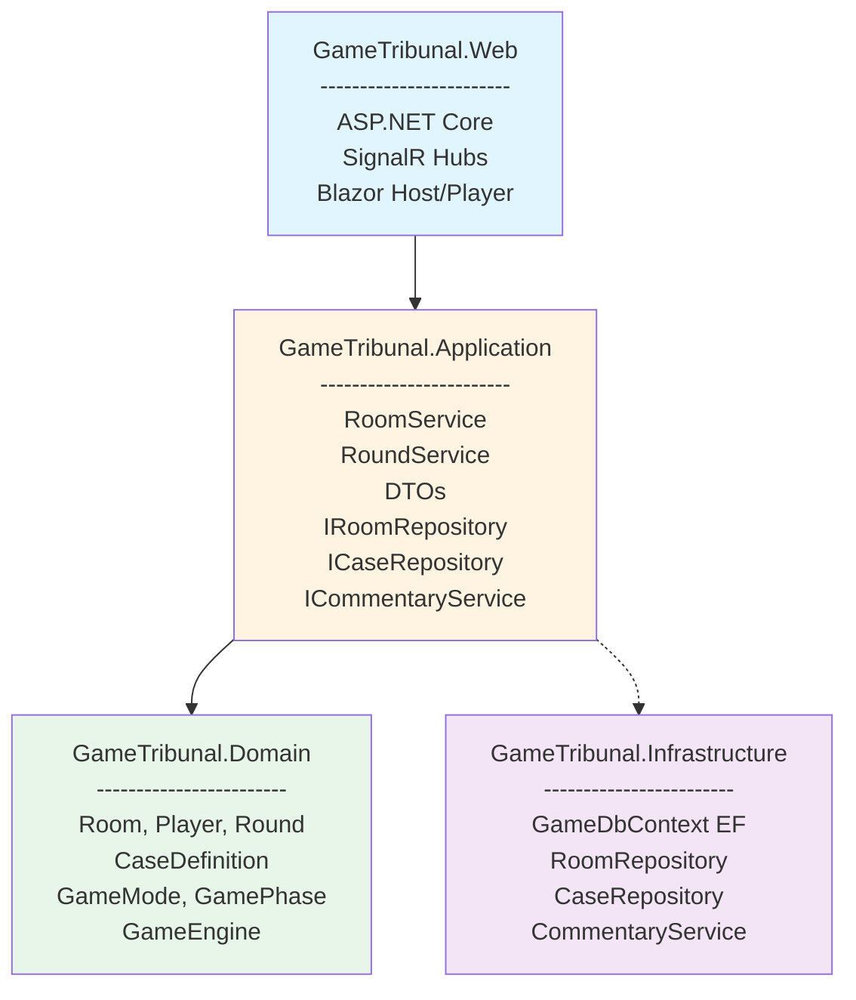
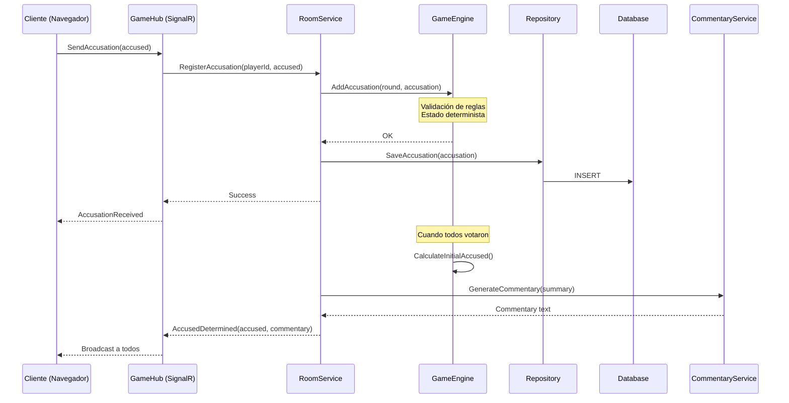

# Arquitectura de la solución

La arquitectura del proyecto está diseñada para ser **simple de implementar**, **fácil de explicar** en un TFG y **suficientemente modular** como para facilitar pruebas y evolución.

Se sigue una estructura en capas ligera sobre **.NET 10**, diferenciando:

- **Dominio**: reglas del juego, entidades y motor de juego.
- **Aplicación**: casos de uso y contratos de servicios.
- **Infraestructura**: persistencia e integración con servicios externos.
- **Web/Presentación**: ASP.NET Core + Blazor + SignalR.

**Principios arquitectónicos:**
- ✅ Separación de responsabilidades (SoC)
- ✅ Inversión de dependencias (DIP)
- ✅ Motor de juego determinista e independiente de I/O
- ✅ Desacoplamiento de la IA del flujo de juego
- ✅ Comunicación en tiempo real mediante SignalR

---

## Proyectos de la solución

La solución .NET se organiza en los siguientes proyectos:

- `GameTribunal.Domain` (Class Library)  
  Modelo de dominio y motor de juego (reglas, estados, puntuaciones).

- `GameTribunal.Application` (Class Library)  
  Servicios de aplicación (casos de uso) y contratos de repositorios/servicios externos.

- `GameTribunal.Infrastructure` (Class Library)  
  Implementación de repositorios con EF Core y servicios como el comentarista IA.

- `GameTribunal.Web` (ASP.NET Core / Blazor / SignalR)  
  Aplicación web ejecutable: Hubs de SignalR y vistas Blazor (pantalla principal y jugadores).

Opcional (para desarrollo con Aspire):

- `GameTribunal.AppHost`  
  Orquestación del entorno (web + BD + servicios) mediante Aspire.

---

## Diagrama lógico



### Responsabilidades por capa

#### GameTribunal.Domain
- **Responsabilidad:** Lógica de negocio pura, sin dependencias externas
- **Contenido:**
  - Entidades: `Room`, `Player`, `Round`, `CaseDefinition`, `TitleAssignment`, `Accusation`, `Prediction`, `DefenseVote`
  - Value Objects: `RoomCode`, `Alias`
  - Enums: `GameMode`, `GamePhase`, `DefenseType`
  - `GameEngine`: orquesta transiciones de fase, cálculo de acusados, puntuación
  - Lógica determinista: mismos inputs → mismos outputs
- **No tiene:** acceso a BD, llamadas HTTP, dependencia de SignalR o Blazor

#### GameTribunal.Application
- **Responsabilidad:** Casos de uso y coordinación entre dominio e infraestructura
- **Contenido:**
  - Servicios: `RoomService`, `RoundService`, `PlayerService`
  - DTOs: `RoomDto`, `PlayerDto`, `RoundDto`, `CaseDto`, etc.
  - Interfaces: `IRoomRepository`, `ICaseRepository`, `ICommentaryService`
  - Validadores de entrada
  - Mappers: Domain ↔ DTOs
- **Depende de:** GameTribunal.Domain
- **No conoce:** detalles de implementación de repositorios, ni tecnología de UI

#### GameTribunal.Infrastructure
- **Responsabilidad:** Implementación de persistencia y servicios externos
- **Contenido:**
  - `GameDbContext` (EF Core)
  - Implementaciones de repositorios: `RoomRepository`, `CaseRepository`
  - `CommentaryService`: integración con API de IA generativa
  - Configuración de entidades (Fluent API)
  - Migraciones de EF Core
- **Depende de:** GameTribunal.Application (interfaces), GameTribunal.Domain (entidades)
- **Tecnologías:** Entity Framework Core, HttpClient para APIs externas

#### GameTribunal.Web
- **Responsabilidad:** Capa de presentación y comunicación en tiempo real
- **Contenido:**
  - `GameHub`: SignalR Hub para comunicación en tiempo real
  - Componentes Blazor:
    - `Pages/Host/`: Vistas para pantalla principal (lobby, partida, resultados)
    - `Pages/Player/`: Vistas para jugadores (unirse, votar, defender)
    - `Shared/`: Componentes reutilizables
  - `Program.cs`: configuración de servicios e inyección de dependencias
  - `appsettings.json`: configuración
- **Depende de:** GameTribunal.Application, GameTribunal.Infrastructure
- **Tecnologías:** ASP.NET Core, SignalR, Blazor Server

#### GameTribunal.AppHost (opcional)
- **Responsabilidad:** Orquestación del entorno de desarrollo
- **Contenido:**
  - Declaración de recursos (web app, BD, servicios)
  - Configuración de Aspire para desarrollo local
- **Uso:** Simplifica ejecución en desarrollo con `dotnet run --project GameTribunal.AppHost`

---

## Flujo de Datos



**Puntos clave:**
1. El Hub actúa como punto de entrada y orquestador
2. Los servicios de aplicación coordinan dominio + infraestructura
3. El GameEngine contiene lógica pura (testeable sin BD ni SignalR)
4. La IA es un servicio externo opcional (no afecta el flujo principal)
5. Los cambios se persisten inmediatamente para permitir reconexión

---

## Inyección de Dependencias

En `Program.cs` se configuran los servicios:

```csharp
// Domain (sin servicios a registrar, son POCOs)

// Application
builder.Services.AddScoped<IRoomService, RoomService>();
builder.Services.AddScoped<IRoundService, RoundService>();
builder.Services.AddScoped<IPlayerService, PlayerService>();
builder.Services.AddSingleton<GameEngine>();

// Infrastructure
builder.Services.AddDbContext<GameDbContext>(options =>
    options.UseSqlServer(builder.Configuration.GetConnectionString("GameDb")));
builder.Services.AddScoped<IRoomRepository, RoomRepository>();
builder.Services.AddScoped<ICaseRepository, CaseRepository>();
builder.Services.AddHttpClient<ICommentaryService, CommentaryService>();

// Web / SignalR
builder.Services.AddSignalR();
builder.Services.AddServerSideBlazor();

var app = builder.Build();

// Middleware pipeline
app.UseHttpsRedirection();
app.UseStaticFiles();
app.UseRouting();

app.MapHub<GameHub>("/gamehub");
app.MapBlazorHub();
app.MapFallbackToPage("/_Host");

app.Run();
```

---

## Estrategia de Persistencia

### Modelo de consistencia

- **Escritura inmediata:** Cada acción del jugador se persiste de inmediato
- **Lectura desde caché (Room en memoria):** El estado de la sala activa se mantiene en memoria durante la partida
- **Sincronización:** Al persistir, se actualiza tanto la BD como el estado en memoria

### Gestión de transacciones

- Las operaciones críticas (iniciar ronda, calcular puntuación) usan transacciones
- Si falla la persistencia, se revierte el cambio en memoria y se notifica error

### Limpieza de datos

- Salas inactivas (>2 horas sin actividad) se marcan como finalizadas
- Proceso en background (HostedService) limpia salas antiguas periódicamente
- Opcionalmente, se pueden archivar partidas completas para análisis posterior

---

## Escalabilidad y Límites

### Límites de diseño actual

| Aspecto | Límite | Justificación |
|---------|--------|---------------|
| Jugadores por sala | 4-16 | Diseño de juego (party game presencial) |
| Salas concurrentes | ~50-100 | Depende del servidor; SignalR escala bien |
| Duración de partida | 30-60 min | Típico para 8-10 rondas |
| Tamaño mensaje SignalR | <10 KB | Mensajes pequeños (votos, IDs) |

### Consideraciones de escalabilidad futura

Si se requiere escalar más allá de estos límites:

- **Múltiples servidores:** SignalR con backplane (Redis o Azure SignalR Service)
- **Separación de salas:** Cada sala es independiente, fácil de distribuir
- **Caché distribuida:** Redis para mantener estado de salas activas
- **BD separada:** Microservicio de persistencia independiente

**Para el alcance del TFG:** Un único servidor es suficiente.

---

## Gestión de Configuración

### appsettings.json

```json
{
  "ConnectionStrings": {
    "GameDb": "Server=localhost;Database=GameTribunal;..."
  },
  "SignalR": {
    "KeepAliveInterval": "00:00:15",
    "ClientTimeoutInterval": "00:00:30"
  },
  "GameSettings": {
    "DefaultRounds": 10,
    "RoomCodeLength": 6,
    "InactivityTimeoutMinutes": 120
  },
  "Commentary": {
    "Provider": "OpenAI",
    "ApiKey": "*** usar Secret Manager ***",
    "Model": "gpt-4",
    "MaxTokens": 150,
    "EnableFallback": true
  },
  "Logging": {
    "LogLevel": {
      "Default": "Information",
      "Microsoft.AspNetCore.SignalR": "Debug"
    }
  }
}
```

### Gestión de secretos

- **Desarrollo:** `dotnet user-secrets` para API keys
- **Producción:** Variables de entorno o Azure Key Vault
- **Nunca** commitear secretos en git

---

## Consideraciones de Testing

### Testabilidad por capa

| Capa | Tipo de test | Herramientas | Dependencias mockeadas |
|------|--------------|--------------|------------------------|
| Domain | Unitarias | xUnit | Ninguna (lógica pura) |
| Application | Unitarias | xUnit + Moq | Repositorios, servicios externos |
| Infrastructure | Integración | xUnit + EF InMemory | Base de datos real (opcional) |
| Web | Integración | WebApplicationFactory | Toda la stack |

### Ejemplo de test de GameEngine

```csharp
[Fact]
public void CalculateInitialAccused_WithClearMajority_ReturnsCorrectPlayer()
{
    // Arrange
    var room = CreateRoomWithPlayers(4);
    var round = new Round(/* ... */);
    round.AddAccusation(player1, player3); // P1 acusa a P3
    round.AddAccusation(player2, player3); // P2 acusa a P3
    round.AddAccusation(player3, player4); // P3 acusa a P4
    round.AddAccusation(player4, player3); // P4 acusa a P3
    
    var engine = new GameEngine();
    
    // Act
    var accused = engine.CalculateInitialAccused(round);
    
    // Assert
    Assert.Equal(player3.Id, accused.Id); // 3 votos para P3
}
```

Este enfoque permite validar la lógica de juego sin dependencias externas.

---

## Próximos Pasos en Arquitectura

- [ ] Definir contratos detallados de `ICommentaryService`
- [ ] Especificar formato de prompts para IA
- [ ] Diseñar sistema de caché para `CaseDefinition` (datos estáticos)
- [ ] Implementar health checks para monitorización
- [ ] Diseñar estrategia de logging estructurado (Serilog)
- [ ] Considerar patrón CQRS si la complejidad lo requiere (probablemente no necesario)