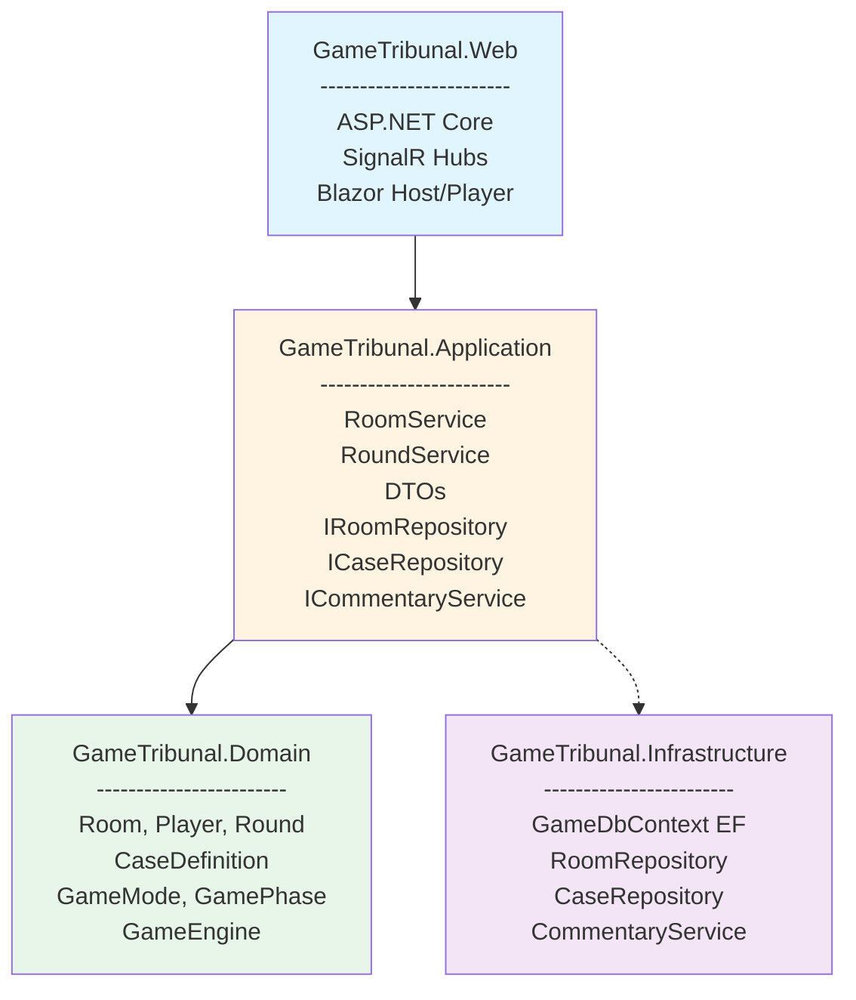

# Arquitectura de la solución

La arquitectura del proyecto está diseñada para ser **simple de implementar**, **fácil de explicar** en un TFG y **suficientemente modular** como para facilitar pruebas y evolución.

Se sigue una estructura en capas ligera sobre **.NET 10**, diferenciando:

- **Dominio**: reglas del juego.
- **Aplicación**: casos de uso.
- **Infraestructura**: persistencia e integración con servicios externos.
- **Web/Presentación**: ASP.NET Core + Blazor + SignalR.

---

## Proyectos de la solución

La solución .NET se organiza en los siguientes proyectos:

- `GameTribunal.Domain` (Class Library)  
  Modelo de dominio y motor de juego (reglas, estados, puntuaciones).

- `GameTribunal.Application` (Class Library)  
  Servicios de aplicación (casos de uso) y contratos de repositorios/servicios externos.

- `GameTribunal.Infrastructure` (Class Library)  
  Implementación de repositorios con EF Core y servicios como el comentarista IA.

- `GameTribunal.Web` (ASP.NET Core / Blazor / SignalR)  
  Aplicación web ejecutable: Hubs de SignalR y vistas Blazor (pantalla principal y jugadores).

Opcional (para desarrollo con Aspire):

- `GameTribunal.AppHost`  
  Orquestación del entorno (web + BD + servicios) mediante Aspire.

---

## Diagrama lógico

