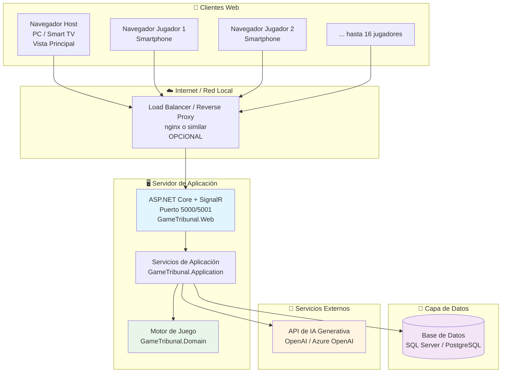
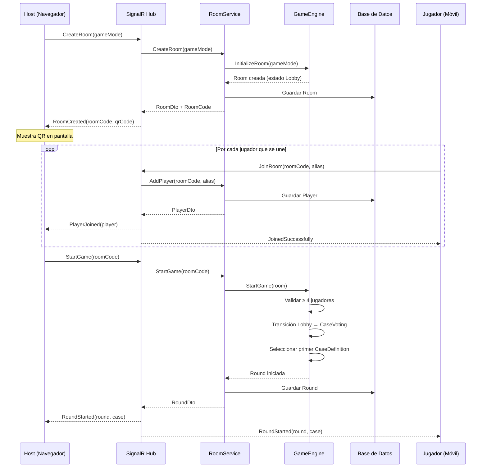
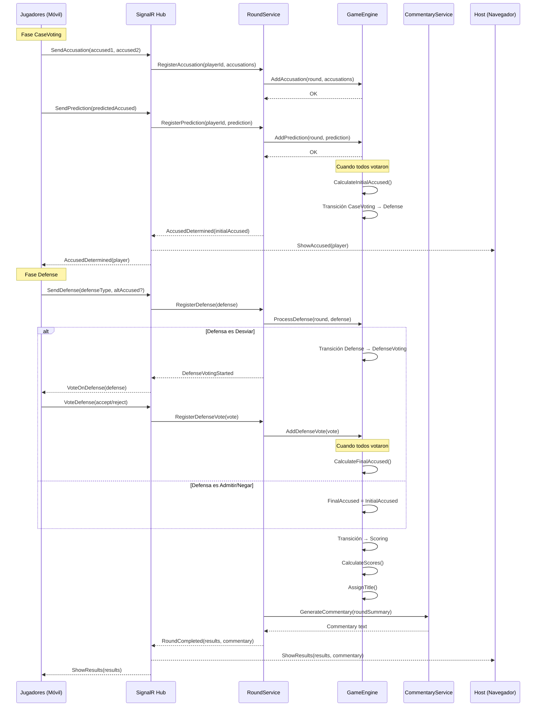
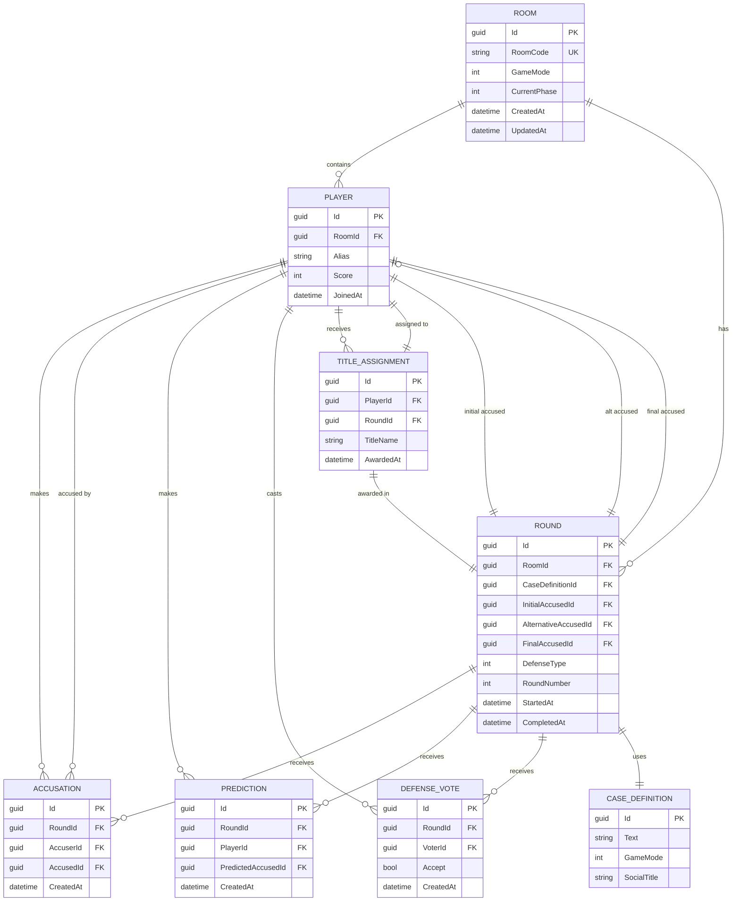

# Diseño Técnico

Este documento amplía la arquitectura y detalla los principales diagramas, especificaciones técnicas y contratos de interfaz del proyecto.

---

## 1. Diagramas de Arquitectura

### 1.1 Diagrama de Despliegue

El siguiente diagrama muestra cómo se despliegan los componentes del sistema:



**Notas de despliegue:**
- En desarrollo, todo corre localmente (web app + BD local)
- En producción, se puede desplegar en Azure App Service, AWS, o servidor propio
- El load balancer es opcional pero recomendado para entornos de producción
- HTTPS es obligatorio para WebSockets en navegadores modernos

### 1.2 Diagrama de Secuencia - Inicio de Partida



### 1.3 Diagrama de Secuencia - Flujo de Acusación y Defensa



### 1.4 Modelo de Datos (ERD)



---

## 2. Especificación de Interfaces

### 2.1 SignalR Hub - Contrato de Métodos

El `GameHub` expone los siguientes métodos que los clientes pueden invocar:

#### Métodos del Hub (servidor)

```csharp
public interface IGameHub
{
    // Gestión de salas
    Task<RoomDto> CreateRoom(GameMode gameMode);
    Task<PlayerDto> JoinRoom(string roomCode, string alias);
    Task LeaveRoom(string roomCode);
    
    // Control de partida
    Task StartGame(string roomCode);
    Task<RoundDto> GetCurrentRound(string roomCode);
    
    // Acciones de jugadores durante la partida
    Task SendAccusation(string roomCode, List<Guid> accusedPlayerIds);
    Task SendPrediction(string roomCode, Guid predictedAccusedId);
    Task SendDefense(string roomCode, DefenseType defenseType, Guid? alternativeAccusedId);
    Task VoteDefense(string roomCode, bool accept);
    
    // Consultas
    Task<RoomStateDto> GetRoomState(string roomCode);
    Task<List<PlayerDto>> GetPlayers(string roomCode);
    Task<ScoreboardDto> GetScoreboard(string roomCode);
}
```

#### Eventos del Hub (notificaciones a clientes)

```csharp
public interface IGameHubClient
{
    // Eventos de sala
    Task RoomCreated(RoomDto room, string qrCodeDataUrl);
    Task RoomUpdated(RoomStateDto state);
    
    // Eventos de jugadores
    Task PlayerJoined(PlayerDto player);
    Task PlayerLeft(Guid playerId);
    
    // Eventos de partida
    Task GameStarted();
    Task RoundStarted(RoundDto round, CaseDto caseDefinition);
    Task PhaseChanged(GamePhase newPhase);
    
    // Eventos de votación
    Task AccusationReceived(Guid playerId);  // Notificación genérica sin revelar el voto
    Task PredictionReceived(Guid playerId);
    Task AllVotesReceived();
    
    // Eventos de defensa
    Task AccusedDetermined(Guid accusedPlayerId, int accusationCount);
    Task DefenseReceived(DefenseType defenseType, Guid? alternativeAccusedId);
    Task DefenseVotingStarted(Guid originalAccused, Guid alternativeAccused);
    Task DefenseVoteReceived(Guid voterId);
    
    // Eventos de resultados
    Task RoundCompleted(RoundResultDto result, string? commentary);
    Task ScoreboardUpdated(ScoreboardDto scoreboard);
    Task GameFinished(GameSummaryDto summary);
    
    // Eventos de error
    Task ErrorOccurred(string message);
}
```

### 2.2 DTOs Principales

#### RoomDto
```csharp
public record RoomDto(
    Guid Id,
    string RoomCode,
    GameMode GameMode,
    GamePhase CurrentPhase,
    int PlayerCount,
    DateTime CreatedAt
);
```

#### PlayerDto
```csharp
public record PlayerDto(
    Guid Id,
    string Alias,
    int Score,
    List<string> Titles,
    bool IsConnected
);
```

#### RoundDto
```csharp
public record RoundDto(
    Guid Id,
    int RoundNumber,
    CaseDto Case,
    GamePhase CurrentPhase,
    Guid? InitialAccusedId,
    Guid? FinalAccusedId
);
```

#### CaseDto
```csharp
public record CaseDto(
    Guid Id,
    string Text,
    string SocialTitle,
    GameMode GameMode
);
```

#### RoundResultDto
```csharp
public record RoundResultDto(
    Guid RoundId,
    Guid FinalAccusedId,
    string AssignedTitle,
    Dictionary<Guid, int> PointsAwarded,  // PlayerId -> Puntos ganados esta ronda
    List<Guid> CorrectAccusers,
    List<Guid> CorrectPredictors,
    bool DefenseSuccessful
);
```

#### ScoreboardDto
```csharp
public record ScoreboardDto(
    List<PlayerScoreDto> Rankings,  // Ordenado por puntuación descendente
    int CurrentRound,
    int TotalRounds
);

public record PlayerScoreDto(
    Guid PlayerId,
    string Alias,
    int Score,
    List<string> Titles,
    int Position
);
```

#### GameSummaryDto
```csharp
public record GameSummaryDto(
    ScoreboardDto FinalScoreboard,
    Dictionary<string, int> TitleFrequency,  // Título -> Veces asignado
    TimeSpan GameDuration,
    int TotalRounds
);
```

#### RoomStateDto
```csharp
public record RoomStateDto(
    RoomDto Room,
    List<PlayerDto> Players,
    RoundDto? CurrentRound,
    GamePhase CurrentPhase
);
```

### 2.3 Enumeraciones

#### GameMode
```csharp
public enum GameMode
{
    Suave = 0,    // Casos suaves, para grupos que se conocen poco
    Normal = 1,   // Casos estándar
    Spicy = 2     // Casos más atrevidos, para grupos de confianza
}
```

#### GamePhase
```csharp
public enum GamePhase
{
    Lobby = 0,           // Esperando jugadores
    CaseVoting = 1,      // Votando acusaciones y predicciones
    Defense = 2,         // Acusado defendiéndose
    DefenseVoting = 3,   // Votando si se acepta la defensa de desvío
    Scoring = 4,         // Calculando y mostrando resultados
    Finished = 5         // Partida terminada
}
```

#### DefenseType
```csharp
public enum DefenseType
{
    Admitir = 0,   // "Lo admito"
    Negar = 1,     // "No encaja conmigo"
    Desviar = 2    // "Creo que es más bien [otro jugador]"
}
```

---

## 3. Reglas de Validación

### 3.1 Validaciones de entrada

| Campo | Reglas |
|-------|--------|
| Alias de jugador | - Longitud: 3-20 caracteres<br/>- Caracteres alfanuméricos y espacios<br/>- Único dentro de la sala |
| RoomCode | - Formato: 6 caracteres alfanuméricos uppercase<br/>- Único globalmente |
| Acusaciones | - Mínimo 1, máximo 2 acusados<br/>- No se puede acusar a sí mismo<br/>- IDs deben ser jugadores válidos de la sala |
| Predicción | - Exactamente 1 predicción<br/>- Debe ser un jugador válido de la sala |
| Defensa de desvío | - Debe especificar alternativeAccusedId<br/>- No puede ser el acusado original<br/>- Debe ser jugador válido |

### 3.2 Validaciones de estado

| Acción | Precondiciones |
|--------|----------------|
| Iniciar partida | - Fase = Lobby<br/>- Mínimo 4 jugadores conectados |
| Enviar acusación | - Fase = CaseVoting<br/>- Jugador no ha votado aún |
| Enviar defensa | - Fase = Defense<br/>- Solo el acusado inicial puede defenderse |
| Votar defensa | - Fase = DefenseVoting<br/>- Jugador no es el acusado original |

---

## 4. Gestión de Errores

### 4.1 Códigos de error

| Código | Descripción | Acción del cliente |
|--------|-------------|-------------------|
| ROOM_NOT_FOUND | Sala no existe | Mostrar error, volver a lobby |
| ROOM_FULL | Sala llena (16 jugadores) | Mostrar mensaje, no permitir unirse |
| ALIAS_TAKEN | Alias ya en uso | Solicitar alias diferente |
| INVALID_PHASE | Acción no válida en fase actual | Sincronizar estado con servidor |
| PLAYER_NOT_FOUND | Jugador no existe | Error interno, reconectar |
| INVALID_VOTE | Voto inválido | Mostrar error, permitir reintentar |

### 4.2 Manejo de desconexiones

- **Desconexión temporal (<30s):** El jugador se marca como desconectado pero no se elimina. Puede reconectarse automáticamente.
- **Desconexión prolongada (>30s):** 
  - En Lobby: El jugador se elimina de la sala
  - En partida: El jugador se marca como inactivo, sus votos pendientes se omiten
- **Reconexión:** El cliente recibe el estado completo actual mediante `GetRoomState()`

---

## 5. Consideraciones de Seguridad

### 5.1 Validación en servidor

- ✅ Todas las acciones se validan en el servidor (nunca confiar en el cliente)
- ✅ RoomCode actúa como token de acceso simple
- ✅ Límite de rate limiting por IP (prevenir spam)
- ✅ Validación de longitud de strings (prevenir ataques de memoria)
- ✅ Sanitización de alias (prevenir XSS en nombres)

### 5.2 Datos sensibles

- ⚠️ No se almacenan datos personales reales (solo pseudónimos temporales)
- ⚠️ Las salas son efímeras (se limpian tras inactividad)
- ⚠️ No hay sistema de cuentas ni passwords

---

## 6. Próximos Pasos

Este documento se completará con:

- [ ] Especificación detallada de la API de IA (prompts, formato de respuesta)
- [ ] Diagramas de componentes Blazor
- [ ] Wireframes de interfaz (host y jugador)
- [ ] Especificación de configuración (appsettings)
- [ ] Política de limpieza de salas inactivas
