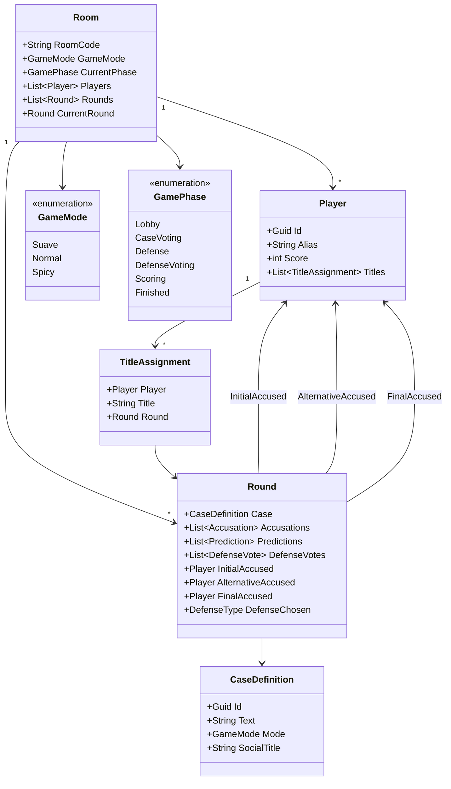
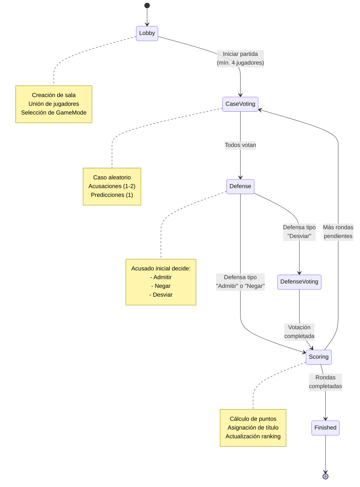
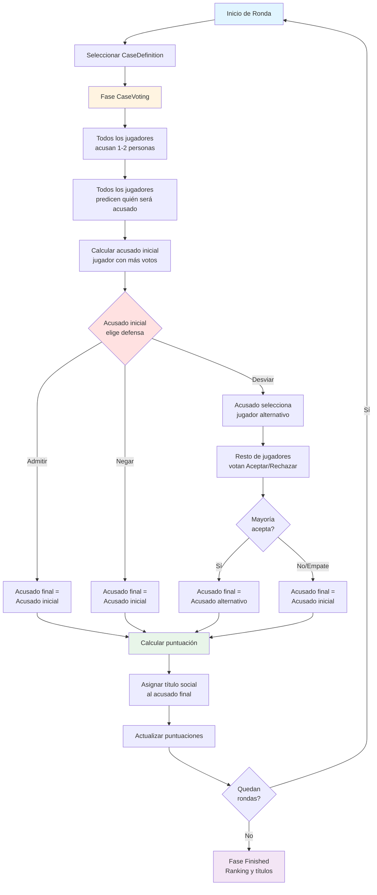
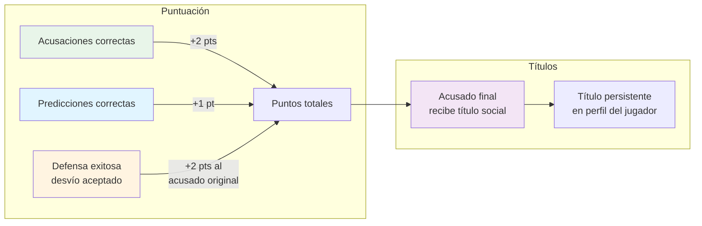
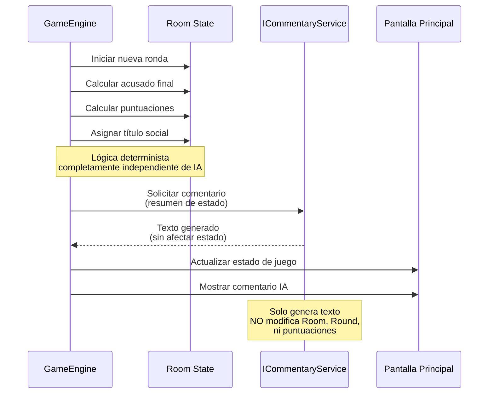

# Lógica de juego

Este documento describe las reglas de juego de **Tribunal Social**: el modelo conceptual, las fases de una partida y cómo se calculan acusaciones, defensas, resultados y títulos sociales.

---

## 1. Objetivo del juego

El juego está diseñado para:

- generar **situaciones sociales** basadas en casos del estilo “¿Quién es más probable que…?”
- obligar al grupo a **señalar** a miembros concretos,
- producir **pequeñas fricciones y risas** a través de acusaciones y defensas,
- asignar **títulos sociales** que se convierten en running gags del grupo.

No hay un “ganador absoluto” en términos profundos: la competición existe (puntuación), pero el foco es la dinámica social.

---

## 2. Modelo de dominio (resumen)

### Entidades principales

- `Room`
  - Código de sala (`RoomCode`).
  - Modo de juego (`GameMode`): `Suave`, `Normal`, `Spicy`.
  - Lista de `Player`.
  - Lista de `Round` jugadas.
  - Fase actual (`GamePhase`).
  - Ronda en curso.

- `Player`
  - Identificador interno.
  - Alias visible para el grupo.
  - Puntuación acumulada.
  - Lista de `TitleAssignment` (títulos sociales recibidos).

- `CaseDefinition`
  - Identificador.
  - Texto del caso (ej.: “¿Quién es más probable que llegue siempre tarde?”).
  - `GameMode` al que pertenece.
  - Título social asociado al caso (ej.: “Señor/a de la impuntualidad crónica”).

- `Round`
  - Referencia a `CaseDefinition`.
  - Colecciones de votos:
    - `Accusations` (quién acusa a quién).
    - `Predictions` (quién cree que será el acusado oficial).
    - `DefenseVotes` (votos sobre si se acepta o no la defensa).
  - Acusado inicial.
  - Acusado alternativo (en caso de defensa de desvío).
  - Acusado final (tras defensa y votación).
  - Resultado de puntuación.

- `TitleAssignment`
  - Jugador.
  - Título recibido.
  - Ronda en la que se otorgó.

---

## 3. Fases de la partida (`GamePhase`)

Una partida progresa por varias fases:

1. **Lobby**
   - Se crea la sala y se elige `GameMode`.
   - Los jugadores se unen introduciendo alias (vía QR + web).
   - Cuando hay al menos 4 jugadores, se puede iniciar la partida.

2. **CaseVoting**
   - El motor selecciona un `CaseDefinition` aleatorio compatible con el `GameMode`.
   - Todos los jugadores:
     - emiten **acusaciones** (1–2 acusados, excepto a sí mismos),
     - realizan una **predicción** (quién creen que será el acusado según la mayoría).

3. **Defense**
   - Se calcula el **acusado inicial**: el jugador con más votos de acusación.
   - Este jugador elige una opción de defensa entre un conjunto discreto (configurable), por ejemplo:
     - `Admitir` (reconocimiento jocoso),
     - `Negar` (rechazo del papel),
     - `Desviar` (señalar a otro jugador como más adecuado para el caso).
   - En caso de `Desviar`, se registra un `altAccused`.

4. **DefenseVoting**
   - Si la defensa ha sido de desvío:
     - El resto de jugadores (según reglas) vota si acepta o no la defensa.
     - Voto binario: `Aceptar` / `Rechazar`.
   - Si la defensa no es de desvío, esta fase puede omitirse o simplificarse.

5. **Scoring**
   - Se decide el **acusado final**:
     - Si no hay desvío → acusado final = acusado inicial.
     - Si hay desvío → acusado final = acusado alternativo si la defensa se acepta por mayoría; en caso contrario sigue siendo el acusado inicial.
   - Se otorgan puntos según reglas (ver sección siguiente).
   - Se asigna al acusado final el **título social** asociado al `CaseDefinition`.
   - Se actualizan puntuaciones de todos los jugadores.

6. **Finished**
   - Tras N rondas/casos (configurable), la partida termina.
   - Se muestran:
     - ranking de puntuaciones,
     - títulos acumulados por jugador,
     - “perfil social” derivado de los títulos.

Toda la transición entre fases la gestiona el `GameEngine` con métodos que garantizan la coherencia del flujo de juego.

---

## 4. Reglas de votación y defensa

### 4.1 Acusaciones

- Cada jugador puede:
  - votar a 1 o 2 acusados por caso (configurable).
  - no se permite votar a uno mismo.
- El acusado inicial se calcula como el jugador con mayor número de votos de acusación.
- En caso de empate, se aplican reglas deterministas, por ejemplo:
  - desempatar por jugador con más títulos previos de la misma categoría,
  - o por orden de jugador en la lista si se quiere algo más simple.

### 4.2 Predicciones

- Cada jugador elige exactamente 1 nombre en la fase de predicción:
  - su hipótesis sobre quién será el acusado.
- Las predicciones no afectan al veredicto; sólo al sistema de puntuación.

### 4.3 Defensa

- El acusado inicial escoge una **opción discreta** de defensa. Ejemplo de opciones:

  - `Admitir`:
    - mensaje del estilo “lo admito, suena a algo que haría”.
    - no cambia el acusado, pero puede otorgar puntos de “autoaceptación” si se quiere.

  - `Negar`:
    - mensaje del estilo “no me encaja nada conmigo”.
    - no cambia el acusado.

  - `Desviar`:
    - el acusado elige a otro jugador como “culpable alternativo”.
    - activa una fase de votación de defensa.

### 4.4 Votación de defensa

- Sólo se aplica si hubo defensa de desvío.
- El resto de jugadores vota `Aceptar` / `Rechazar`.
- Si hay mayoría de "Aceptar":
  - acusado final = `altAccused`.
- Si hay mayoría de "Rechazar" o empate:
  - acusado final = acusado inicial.

---

## 5. Sistema de puntuación (ejemplo base)

### Reglas de puntuación

La lógica concreta puede ajustarse, pero un esquema base podría ser:

- **Acusaciones:**
  - Cada jugador que acusó al acusado final:
    - +2 puntos.

- **Predicciones:**
  - Cada jugador cuya predicción coincide con el acusado final:
    - +1 punto.

- **Defensa:**
  - Si un acusado logra desviar la culpa (defensa aceptada):
    - +2 puntos al acusado original (por “labia”).
  - Si falla:
    - 0 puntos adicionales (ya ha tenido su momento social).

- **Títulos sociales:**
  - El acusado final recibe el título asociado al caso.
  - Los títulos no añaden puntos extra por sí mismos (o sí, si se quiere), pero sirven como “logros” sociales persistentes.

Esta lógica se centraliza en una operación de `GameEngine.ScoreRound(Room room)`.

---

## 6. Títulos sociales y memoria de la partida

Cada `CaseDefinition` tiene asociado un **título social** estático (predefinido), por ejemplo:

- Caso: “¿Quién es más probable que llegue siempre tarde?”  
  → Título: “Señor/a de la impuntualidad crónica”.

Cuando se resuelve una ronda, el título se asigna al acusado final y se registra un `TitleAssignment`.

Al final de la partida, la pantalla principal muestra, por ejemplo:

- Para cada jugador:
  - Puntos totales.
  - Lista de títulos recibidos.
- Para el grupo:
  - Ranking de títulos más repetidos,
  - “perfil social” del grupo (e.g. “Mucha impuntualidad y mucho drama”).

Este sistema de títulos está pensado para generar conversaciones posteriores (“tú eres el desaparecedor oficial en fiestas”, etc.).

---

## 7. Rol de la IA generativa en la lógica de juego

La IA **no forma parte** de la lógica de juego. Detalles clave:

- No decide casos, votos ni resultados.
- No calcula puntuaciones ni títulos.
- No altera el estado de `Room`, `Round`, etc.

Su rol es únicamente:

1. Recibir resúmenes de:
   - caso jugado,
   - acusado final,
   - votos agregados,
   - puntuaciones,
   - títulos asignados.
2. Generar texto breve de comentario:
   - introducción a la ronda,
   - reacción al veredicto,
   - resumen final de partida.

Esto permite mantener el **motor de juego totalmente determinista**, al tiempo que se añade una capa de entretenimiento dinámico.

---