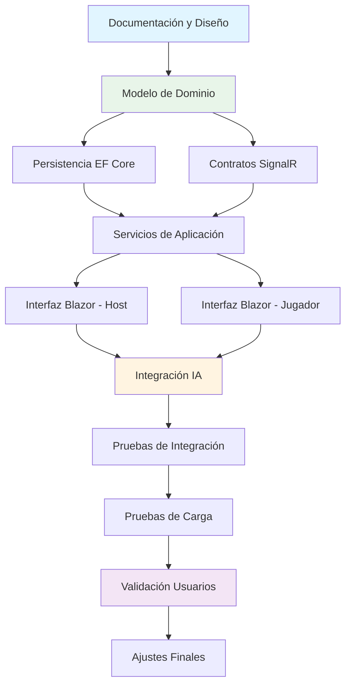

# Planificación del Proyecto

_Actualizado: 17 de noviembre de 2025_

Este documento recoge la planificación temporal, hitos principales, riesgos y estrategia de pruebas.

---

## Roadmap y Hitos

**Nota:** Las fechas son estimativas y se ajustarán según el progreso del proyecto. El proyecto se encuentra actualmente en **fase de implementación inicial** (dominio, SignalR y lobby funcional).

| Hito                | Duración estimada | Estado | Avances recientes |
|---------------------|-------------------|--------|-------------------|
| Diseño y documentación | 2 semanas | En revisión | Documentos de arquitectura, diseño y requisitos actualizados; pendientes últimas reglas en `game-logic.md`. |
| Modelo de dominio   | 2 semanas     | En progreso | Entidades `Room` y `Player`, `RoomCode` y modos de juego implementados con pruebas unitarias. Motor de rondas en análisis. |
| Persistencia inicial| 1 semana      | En progreso | Repositorio in-memory (`InMemoryRoomRepository`) operativo; migración a EF Core programada. |
| SignalR y contratos | 1-2 semanas   | En progreso | `GameHub`, `SignalRRoomService` y DTOs funcionando; faltan contratos definitivos del motor y pruebas end-to-end. |
| Interfaz Blazor     | 2-3 semanas   | En progreso | Vistas de lobby (host) y join (jugadores) conectadas a SignalR y QR. Diseño móvil pendiente. |
| IA comentarista     | 1-2 semanas   | Pendiente | A la espera del motor de rondas y elección de API de IA. |
| Pruebas técnicas    | 1 semana      | Pendiente | Suite xUnit creada; falta integrar la ejecución automática en CI/CD sobre .NET 10.0. |
| Validación usuarios | 1 semana      | Pendiente | Requiere flujo de partida completo. |
| Ajustes finales y documentación | 1 semana | Pendiente | Planificados tras pruebas de usuario. |

**Últimos avances relevantes:**
- RoomService ahora injerta servicios deterministas (`IGuidGenerator`, `IClock`) para garantizar IDs y marcas de tiempo reproducibles al registrar jugadores.
- La entidad `Player` valida identificadores y timestamps UTC, eliminando dependencias directas de `Guid.NewGuid()` y `DateTime.UtcNow` dentro del dominio.
- GameHub y PlayerStatusMonitorService emplean el reloj compartido para sincronizar actualizaciones de actividad y estados de conexión sin discrepancias entre nodos.
- Suite de pruebas actualizada (`PlayerTests`, `RoomTests`, `RoomServiceTests`, `SignalRIntegrationTests`) cubre los nuevos contratos deterministas y evita reflección o esperas activas.
- Interfaz Blazor para lobby y unirse a sala enlazada con SignalR, códigos QR y validaciones de alias.
- Repositorio in-memory e integración QR disponibles para iteración rápida en entorno local.

**Hitos clave:**
- **M1:** Documentación base actualizada; resta consolidar reglas detalladas y checklist de QA.
- **M2:** Motor de juego funcional con tests unitarios (en preparación; actualmente cubierto lobby y administración de sala).
- **M3:** Comunicación en tiempo real operativa (versión inicial lista con SignalR; pendiente orquestar fases del juego).
- **M4:** Prototipo jugable end-to-end (dependiente del motor de rondas y persistencia EF Core).
- **M5:** Versión completa con IA y tests de usuario.

---

## Análisis de Riesgos

| Riesgo | Impacto | Probabilidad | Mitigación |
|--------|---------|--------------|------------|
| **Latencia excesiva en tiempo real** | Alto | Medio | - Pruebas de carga tempranas con SignalR - Optimización de mensajes (solo enviar deltas) - Configuración de timeouts y reconexión automática |
| **Dificultad integración IA** | Medio | Medio | - Prototipo temprano con API de IA - Fallback a mensajes estáticos predefinidos - Interfaz desacoplada (ICommentaryService) |
| **Problemas de compatibilidad en navegadores** | Alto | Bajo | - Test en dispositivos y navegadores variados (Chrome, Safari, Edge, Firefox) - Uso de tecnologías web estándar - Polyfills si son necesarios |
| **Estandarización entorno .NET 10** | Medio | Medio | - Documentar requisitos de entorno y versiones exactas - Configurar CI/CD y estaciones locales con SDK 10.0 GA - Monitorizar actualizaciones de servicing para aplicar parches |
| **Complejidad del motor de juego** | Medio | Medio | - Diseño determinista desde el inicio - Pruebas unitarias exhaustivas - Documentación detallada de reglas en game-logic.md |
| **Escalabilidad con 16 jugadores** | Medio | Bajo | - Pruebas de carga simulando 16 conexiones concurrentes - Optimización de queries a base de datos - Caché de datos estáticos (casos) |
| **Experiencia de usuario en móviles** | Alto | Bajo | - Diseño mobile-first para interfaz de jugador - Tests en dispositivos reales - Iteración basada en feedback de usuarios |

---

## Estrategia de Pruebas

### Niveles de prueba

#### 1. Pruebas unitarias
- **Objetivo:** Validar la lógica del motor de juego de forma aislada
- **Herramientas:** xUnit, Moq
- **Cobertura mínima:** 80% en GameEngine y servicios de aplicación
- **Ejemplos:**
  - Cálculo correcto del acusado inicial con diferentes distribuciones de votos
  - Desempate determinista en acusaciones
  - Asignación correcta de puntos según reglas
  - Transiciones de fase válidas
- **Estado actual:** Suite inicial que cubre `Player`, `Room` y `RoomService` en xUnit; ejecutable con SDK .NET 10.0 instalado en local.

#### 2. Pruebas de integración
- **Objetivo:** Validar la comunicación entre componentes
- **Herramientas:** WebApplicationFactory, TestServer
- **Alcance:**
  - Interacción con SignalR Hubs
  - Persistencia con EF Core (base de datos en memoria)
  - Flujo completo de una ronda de juego
- **Ejemplos:**
  - Crear sala → unir jugadores → iniciar partida → completar ronda
- **Estado actual:** Casos de `RoomService` con Moq para RF-011/RF-012 implementados; falta TestServer con pipeline web completo.

#### 3. Pruebas de componente (Blazor)
- **Objetivo:** Validar el comportamiento de la UI
- **Herramientas:** bUnit
- **Alcance:**
  - Renderizado correcto según estado
  - Interacción con eventos de usuario
  - Sincronización con SignalR
- **Estado actual:** Pendiente; se habilitará tras estabilizar componentes `Lobby` y `Join`.

#### 4. Pruebas de carga y concurrencia
- **Objetivo:** Validar el rendimiento con múltiples jugadores
- **Herramientas:** Scripts en .NET o k6
- **Escenarios:**
  - 1 sala con 4 jugadores (mínimo)
  - 1 sala con 16 jugadores (máximo)
  - 5 salas concurrentes con 8 jugadores cada una
- **Métricas:**
  - Tiempo de respuesta < 500ms para acciones críticas
  - Uso de memoria y CPU
  - Estabilidad de conexiones WebSocket
- **Estado actual:** Pendiente; scripts de carga se diseñarán cuando SignalR esté desplegado en entorno de pruebas.

#### 5. Pruebas end-to-end (opcional)
- **Objetivo:** Validar el flujo completo desde el navegador
- **Herramientas:** Playwright for .NET
- **Escenarios:**
  - Flujo completo de partida con múltiples navegadores simulados
  - Reconexión tras pérdida de conexión
- **Estado actual:** No iniciado; planificado una vez que el motor de rondas esté disponible.

#### 6. Validación con usuarios reales
- **Objetivo:** Evaluar la experiencia de usuario y diversión
- **Metodología:**
  - Sesiones de juego con grupos de 4-8 personas
  - Cuestionarios post-juego
  - Observación de interacciones y feedback verbal
- **Aspectos a evaluar:**
  - Facilidad de acceso (QR, navegador)
  - Claridad de reglas e interfaz
  - Nivel de diversión e interacción social
  - Calidad y pertinencia de comentarios IA
  - Bugs o problemas de usabilidad
- **Estado actual:** No iniciado; se programará tras disponer de flujo jugable estable.

### Criterios de aceptación

Para considerar el proyecto listo para entrega:
- ✅ Todas las pruebas unitarias pasan
- ✅ Cobertura de código > 80% en lógica de negocio
- ✅ Pruebas de integración principales pasan
- ✅ Pruebas de carga validan estabilidad con 16 jugadores
- ✅ Al menos 3 sesiones de validación con usuarios reales completadas
- ✅ Bugs críticos resueltos
- ✅ Documentación técnica completa

---

## Dependencias y secuenciación

El proyecto sigue una secuencia de desarrollo lógica:

**Estado actual:** Documentación (A) completa; modelo de dominio (B) y contratos SignalR (D) en progreso; servicios de aplicación y vistas Blazor (E, F, G) operativos en versión inicial; persistencia EF Core (C) e IA (H) pendientes.

**Bloqueadores críticos:**
- No se puede avanzar con persistencia sin el modelo de dominio
- La interfaz requiere contratos de SignalR definidos
- Las pruebas de usuario requieren una versión funcional end-to-end

---

(Completar y actualizar según evolución del proyecto)
