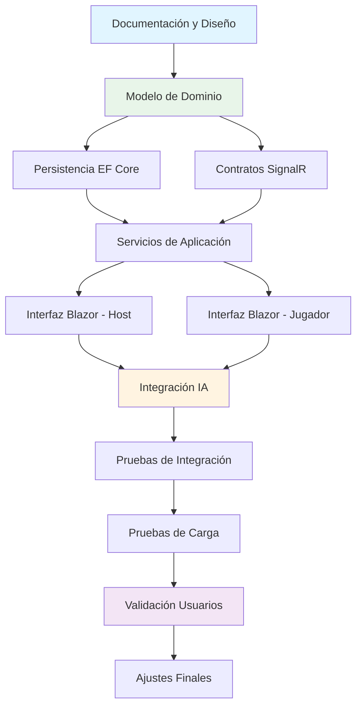

# Planificación del Proyecto

Este documento recoge la planificación temporal, hitos principales, riesgos y estrategia de pruebas.

---

## Roadmap y Hitos

**Nota:** Las fechas son estimativas y se ajustarán según el progreso del proyecto. El proyecto se encuentra actualmente en **fase de diseño y documentación**.

| Hito                | Duración estimada | Estado |
|---------------------|-------------------|--------|
| Diseño y documentación | 2 semanas | En progreso |
| Modelo de dominio   | 2 semanas     | Pendiente |
| Persistencia inicial| 1 semana      | Pendiente |
| SignalR y contratos | 1-2 semanas   | Pendiente |
| Interfaz Blazor     | 2-3 semanas   | Pendiente |
| IA comentarista     | 1-2 semanas   | Pendiente |
| Pruebas técnicas    | 1 semana      | Pendiente |
| Validación usuarios | 1 semana      | Pendiente |
| Ajustes finales y documentación | 1 semana | Pendiente |

**Hitos clave:**
- **M1:** Documentación completa y revisada
- **M2:** Motor de juego funcional con tests unitarios
- **M3:** Comunicación en tiempo real operativa
- **M4:** Prototipo jugable end-to-end
- **M5:** Versión completa con IA y tests de usuario

---

## Análisis de Riesgos

| Riesgo | Impacto | Probabilidad | Mitigación |
|--------|---------|--------------|------------|
| **Latencia excesiva en tiempo real** | Alto | Medio | - Pruebas de carga tempranas con SignalR - Optimización de mensajes (solo enviar deltas) - Configuración de timeouts y reconexión automática |
| **Dificultad integración IA** | Medio | Medio | - Prototipo temprano con API de IA - Fallback a mensajes estáticos predefinidos - Interfaz desacoplada (ICommentaryService) |
| **Problemas de compatibilidad en navegadores** | Alto | Bajo | - Test en dispositivos y navegadores variados (Chrome, Safari, Edge, Firefox) - Uso de tecnologías web estándar - Polyfills si son necesarios |
| **Complejidad del motor de juego** | Medio | Medio | - Diseño determinista desde el inicio - Pruebas unitarias exhaustivas - Documentación detallada de reglas en game-logic.md |
| **Escalabilidad con 16 jugadores** | Medio | Bajo | - Pruebas de carga simulando 16 conexiones concurrentes - Optimización de queries a base de datos - Caché de datos estáticos (casos) |
| **Experiencia de usuario en móviles** | Alto | Bajo | - Diseño mobile-first para interfaz de jugador - Tests en dispositivos reales - Iteración basada en feedback de usuarios |

---

## Estrategia de Pruebas

### Niveles de prueba

#### 1. Pruebas unitarias
- **Objetivo:** Validar la lógica del motor de juego de forma aislada
- **Herramientas:** xUnit, Moq
- **Cobertura mínima:** 80% en GameEngine y servicios de aplicación
- **Ejemplos:**
  - Cálculo correcto del acusado inicial con diferentes distribuciones de votos
  - Desempate determinista en acusaciones
  - Asignación correcta de puntos según reglas
  - Transiciones de fase válidas

#### 2. Pruebas de integración
- **Objetivo:** Validar la comunicación entre componentes
- **Herramientas:** WebApplicationFactory, TestServer
- **Alcance:**
  - Interacción con SignalR Hubs
  - Persistencia con EF Core (base de datos en memoria)
  - Flujo completo de una ronda de juego
- **Ejemplos:**
  - Crear sala → unir jugadores → iniciar partida → completar ronda

#### 3. Pruebas de componente (Blazor)
- **Objetivo:** Validar el comportamiento de la UI
- **Herramientas:** bUnit
- **Alcance:**
  - Renderizado correcto según estado
  - Interacción con eventos de usuario
  - Sincronización con SignalR

#### 4. Pruebas de carga y concurrencia
- **Objetivo:** Validar el rendimiento con múltiples jugadores
- **Herramientas:** Scripts en .NET o k6
- **Escenarios:**
  - 1 sala con 4 jugadores (mínimo)
  - 1 sala con 16 jugadores (máximo)
  - 5 salas concurrentes con 8 jugadores cada una
- **Métricas:**
  - Tiempo de respuesta < 500ms para acciones críticas
  - Uso de memoria y CPU
  - Estabilidad de conexiones WebSocket

#### 5. Pruebas end-to-end (opcional)
- **Objetivo:** Validar el flujo completo desde el navegador
- **Herramientas:** Playwright for .NET
- **Escenarios:**
  - Flujo completo de partida con múltiples navegadores simulados
  - Reconexión tras pérdida de conexión

#### 6. Validación con usuarios reales
- **Objetivo:** Evaluar la experiencia de usuario y diversión
- **Metodología:**
  - Sesiones de juego con grupos de 4-8 personas
  - Cuestionarios post-juego
  - Observación de interacciones y feedback verbal
- **Aspectos a evaluar:**
  - Facilidad de acceso (QR, navegador)
  - Claridad de reglas e interfaz
  - Nivel de diversión e interacción social
  - Calidad y pertinencia de comentarios IA
  - Bugs o problemas de usabilidad

### Criterios de aceptación

Para considerar el proyecto listo para entrega:
- ✅ Todas las pruebas unitarias pasan
- ✅ Cobertura de código > 80% en lógica de negocio
- ✅ Pruebas de integración principales pasan
- ✅ Pruebas de carga validan estabilidad con 16 jugadores
- ✅ Al menos 3 sesiones de validación con usuarios reales completadas
- ✅ Bugs críticos resueltos
- ✅ Documentación técnica completa

---

## Dependencias y secuenciación

El proyecto sigue una secuencia de desarrollo lógica:

**Bloqueadores críticos:**
- No se puede avanzar con persistencia sin el modelo de dominio
- La interfaz requiere contratos de SignalR definidos
- Las pruebas de usuario requieren una versión funcional end-to-end

---

(Completar y actualizar según evolución del proyecto)
